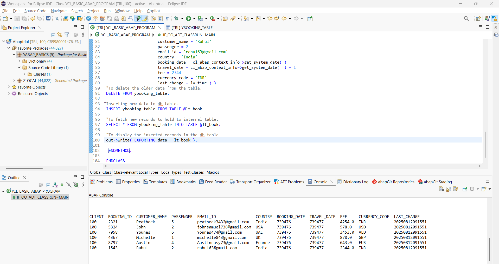
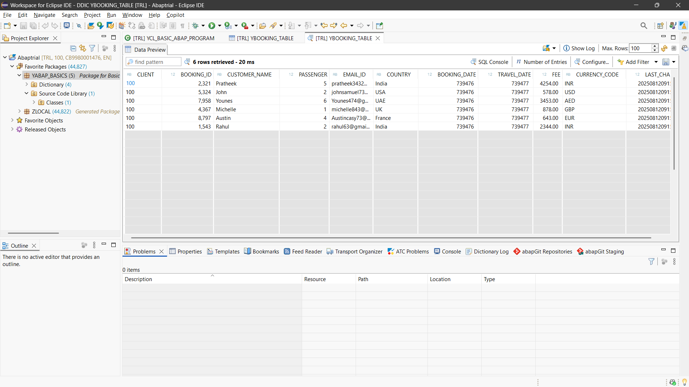

# Basic-ABAP

This repository contains simple ABAP programs developed in the **ABAP BTP Trial** environment.

It features a **Booking Table** for tracking passenger travel and payment details.

---

## 📸 Output Screenshot

Below is an example output from the project:

---

## 🚀 How to Run

### 1️⃣ Prerequisites
- SAP BTP ABAP Environment trial account OR SAP NetWeaver ABAP system.
- [Eclipse IDE](https://www.eclipse.org/downloads/) with **ABAP Development Tools (ADT)**.
- [abapGit](https://abapgit.org/) plugin installed in the ABAP system.

---

### 2️⃣ Clone the Repository into ABAP
1. Open **Eclipse** and connect to your ABAP system.
2. Go to **Window → Show View → Other… → abapGit Repositories**.
3. Click **+ (Add Repository)** → choose **Online Repository**.
4. Paste this repository’s HTTPS link:  
https://github.com/Luthufulhaq/Basic-ABAP.git
5. Choose or create a package (e.g., `ZBASIC_ABAP`).
6. Set the branch to `main` (or select available branch if different).
7. Click **Pull** to import the objects.

---

### 3️⃣ Activate the Objects
- After pulling, right-click the package → **Activate** or press `Ctrl+F3`.

---

### 4️⃣ Run the Program
1. Expand the package → **Source Code Library → Programs**.
2. Right-click the main program → **Run As → ABAP Application (Console)**.
3. View the result in the ABAP console.

---

